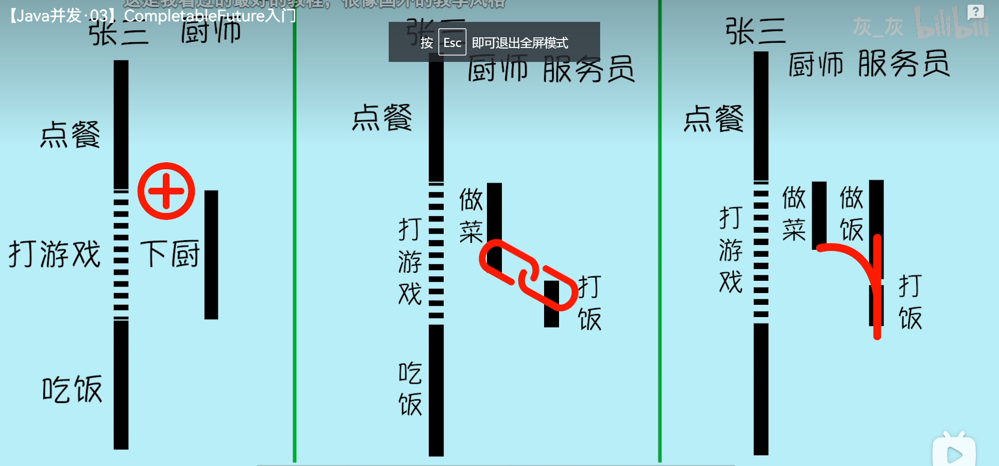

- CompletableFuture#supplyAsync(Supplier)  开启异步线程
- CompletableFuture#thenCompose(Function)  连接两个有依赖关系的任务，结果由后一个任务返回
- CompletableFuture#thenCombine(CompletionStage, BiFunction)  用来合并两个并发执行任务的结果，结果由合并函数 BiFunction 返回



- thenApply 用来做任务的后置处理，与 thenCompose 非常像
- applyToEither  用来获取最先完成的任务
- exceptionally  用来处理异常


---
thenApply vs. thenApplyAsync
thenCompose vs. thenComposeAsync
thenCombine vs. thenCombineAsync
xxx vs. xxxAsync

以 thenApply 方法为例，thenApply 方法的作用就是把后一个的任务加到上一个任务的末尾，
```java
        CompletableFuture
                .supplyAsync(() -> {
                    SmallTool.printTimeAndThread("服务员收款500元");
                    SmallTool.sleepMillis(100); // 收款花了100ms
                    return "500";
                })
                .thenApply((money) -> {
                    // 得到500元收款后，另一个线程（服务员）去给小白开发票
                    SmallTool.printTimeAndThread("服务员去开发票");
                    SmallTool.sleepMillis(200); // 开票花了200ms
                    return String.format("%s元发票", money);
                });
```
也就是说，表面上我们写了两段逻辑独立的代码作为两个任务，但是在 CompletableFuture 看来，
这两段代码就是一个任务要做的事，所以 CompletableFuture 会把这两块代码封装成一个任务交给
线程去运行，所以，这就是这两块代码被同一个线程执行的原因。

但是，如果我们调用的是 thenApplyAsync 方法，那么 CompletableFuture 就会把这两段代码看成
是两个独立的任务，只不过这两个任务存在依赖关系，在第二个任务开始前，必须等第一个任务先执行完，
并且把第一个任务的执行结果交给第二个任务。

其它的 xxx 和 xxxAsync 作用都是类似的。

但是对于 thenCompose 来说，即使不加 Async，调用方法前后的两段代码也会在不同的线程上执行。
那么 thenComposeAsync 的作用是什么呢？
这个有点懵（TODO）

---------

supplyAsync 用于开启一个异步任务
runAsync 也用于开启一个异步任务
区别在于 supplyAsync 有返回值，而 runAsync 没有返回值

-----

thenApply 会接收『上一个任务的结果』作为参数，经过处理之后，返回一个新的结果。
thenRun 和 thenAccept 方法的作用和 thenApply 类似。
区别是：
    thenAccept 会接收『上一个任务的结果』作为参数，但它自己没有返回值
    thenRun 不会接收『上一个任务的结果』，自己也没有返回值

----
thenCombine 可以同时得到两个并行异步任务的执行结果，加工处理之后返回一个新的结果
与之类似的方法，还有 thenAcceptBoth 和 runAfterBoth
区别是：
thenAcceptBoth 得到两个任务的返回值后，直接内部消化了，没有返回值
runAfterBoth 不关心两个任务的返回值，并且自己也没有返回值

---
applyToEither 用来获取两个任务中最先执行完的任务返回的结果，经过处理后，返回新的结果。
类似的方法，还有 acceptEither 和 runAfterEither
同理：
acceptEither 得到先执行完任务的返回值后，内部消化，自己没有返回值；
runAfterEither 既不会得到最先执行完任务的返回值，自己也没有返回值。

----
exceptionally   作用是处理前面调用过程中发生的异常，并且把异常修正为一个正常值返回。
类似的方法有：handle 和 whenComplete

handle(BiFunction) 的参数是 BiFunction，意味着如果前面的程序正常执行，那么就会收到正常执行的结果；
如果前面的程序出现异常，就会接收异常。但是，无论前面的程序是正常还是异常，handle 方法都会返回一个结果，
让后面的程序继续执行。

whenComplete 和 handle 非常像，唯一的区别是它自身没有返回值。

